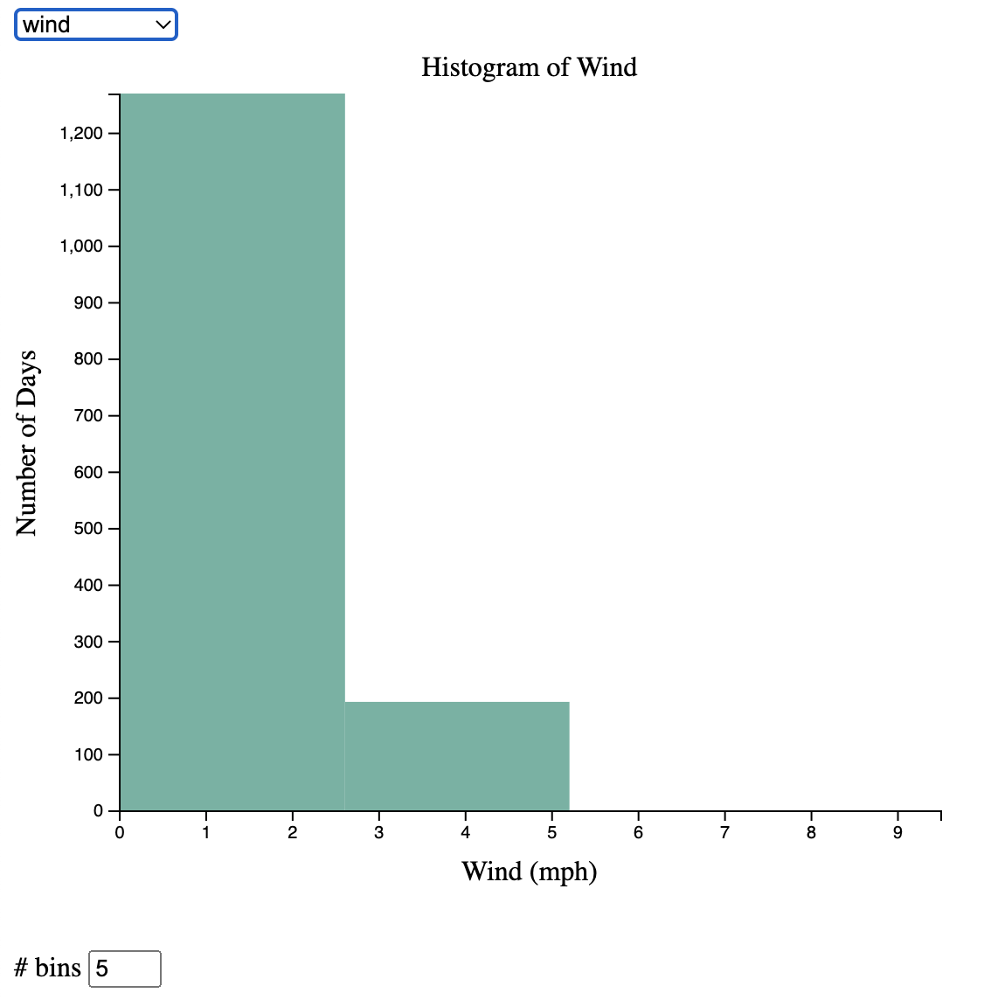
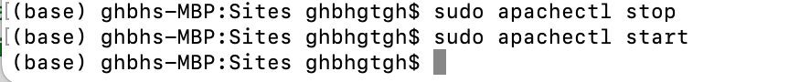

# Cloud Computing HW3
## --IMPORTANT! Please Read--
<b> I downloaded all the csv files from the source to avoid Cross-Origin Resource Sharing (CORS) so all the d3.csv are using files from local storage (which I included in my submission). I don't want to enable the CORS setting on my browser either due to security reasons. </b>

For task3, I created a **les_mis.json** from **les_mis.csv** using javascript for convinence in implementation. To recreate **les_mis.json**, uncomment line `149`:

``` js
// downloadTextFile(dictstring, 'les_mis.json');
```
to
``` js
downloadTextFile(dictstring, 'les_mis.json');
```


## Task 1
### Problem 1.1.1
SVG uses a coordinate system where the top left corner of the document is considered to be point (0,0) with a positive x direction to the right and positive y direction to the bottom. Mathematical graph coordinate space uses a coordinate system where the center of the document is considered to be point (0,0) with a positive x direction to the right and positive y direction to top. 

### Problem 1.1.2
The enter element is used when DOM elements < data elements. When it is used after selectAll and data, it will bind a placeholder element to remaining unbinded data, and the user can define attributes for placeholder after enter() is used. The exit element is used when DOM elements > data elements. When it is used after selectAll and data, it will unbind unused DOM elements and change it according to later commands. 

### Problem 1.1.3
Operations include translation and rotation are collectively called transformation. Thus, transform is an attribute which either translates or rotates selected elements by moving all of their points. Translate an element includes translate(x,y) where x is specified horizontal translation and y is specified vertical translation.

### Problem 1.1.4
d iterates through each data in a, i iterates through each index in a. Thus, the return value should be [5,6,7,8,9]. 

### Problem 1.1.5
The results will be different. In the first script, combination of selectAll(“p”) and .data(myData) will cause p to become binded to the first element of myData: ‘big’. Since there is no enter() command, other data in myData will not be bound to any p or DOM elements, thus will not appear on the webpage.

In the second script, the combination of selectAll(“span”) and .data(data) will not bind anything, since there are no span elements in DOM yet. enter() will create a placeholder for all data elements and create a “span” DOM element for each one of the data and bind them together. Then, text() will add each data element to each binded DOM element. Thus, entire sentences “big data assignment 2 submission” will be printed on the webpage. 

### Problem 1.2.1
```html
<!doctype html>
<html>
    <head>
        <title>HW3 1.2.1</title>
        <script src="https://d3js.org/d3.v2.min.js"></script>
    </head>

    <body>
        <script>

            d3.csv("seattle-weather.csv", function(data) {

                // create a new array only consisting wind (int)
                var map = data.map(function (i) {
                    return parseInt(i.wind);
                });

                var width = 500;
                var height = 500;
                var padding = 60;
                var padding_horizontal=70;

                // create histogram
                var histogram = d3.layout.histogram()
                    .bins(10)
                    (map)

                var canvas = d3.select("body")
                    .append("svg")
                    .attr("width", width+padding_horizontal)
                    .attr("height", height+padding)
                    .append("g")
                        .attr("transform", "translate(65,15)");
                
                // bind data to document
                var bars = canvas.selectAll(".bar")
                    .data(histogram)
                    .enter()
                        .append("g")
                

                var heightScale = d3.scale.linear()
                    .domain([0, d3.max(
                        histogram.map(function(i) { return i.length; })
                    )])
                    .range([0, height]);

                // revert height will only used as y-axis label
                var heightScale_revert = d3.scale.linear()
                    .domain([0, d3.max(histogram.map(function(i) { return i.length; }))])
                    .range([height, 0]);
                
                var widthScale = d3.scale.linear()
                    .domain([0, d3.max(map)])
                    .range([0, width]);
                
                // add x axis
                var xAxis = d3.svg.axis()
                    .scale(widthScale)
                    .orient("bottom");

                // add y axis
                var yAxis = d3.svg.axis()
                    .scale(heightScale_revert)
                    .orient("left");

                // add a group for x axis
                var group_x = canvas.append("g")
                    .attr("transform", "translate(0," + (height+2) + ")")
                    .call(xAxis);

                // add a group for y axis
                var group_y = canvas.append("g")
                    .attr("transform", "translate(-2, 0)")
                    .call(yAxis);

                // bind and style the histogram
                bars.append("rect")
                    // set starting x position of each bar
                    .attr("x", function (d) { return widthScale(d.x); })
                    // set the starting y position of each bar (from beginning: 0)
                    .attr("y", function (d) { return height-heightScale(d.y) })
                    // set width of each bin
                    .attr("width", function (d) { return widthScale(d.dx)-5; })
                    //set height of each bar
                    .attr("height", function (d) { return heightScale(d.y); })
                    //set color of the histogram
                    .attr("fill", "steelblue")
                
                // add text to axis
                bars.append("text")
                    .attr("x", function (d) { return widthScale(d.x) })
                    .attr("y", function (d) { return 500-heightScale(d.y) })
                    .attr("dx", function (d) { return widthScale(d.dx)/2-2 }) // move right
                    .attr("dy", function (d) { return heightScale(d.y)/2 })  // move down
                    .attr("fill", "black")
                    .attr("text-anchor", "middle")
                    .text(function (d) { return d.y })
                
                // add a group for x axis labels
                var group_xlabel = canvas.append("g")
                    .attr("transform", "translate(0," + (height+padding-20) + ")")
                    .append("text")
                        .attr("class", "x label")
                        .attr("text-anchor", "middle")
                        .attr("x", width/2)
                        .text("Wind (mph)");

                // add a group for y axis labels
                var group_ylabel = canvas.append("g")
                    // .attr("transform", "translate(-2, 0)")
                    .append("text")
                        .attr("class", "y label")
                        .attr("text-anchor", "middle")
                        .attr("x", -(height-10)/2)
                        .attr("y", -60)
                        .attr("dy", ".75em")
                        .attr("transform", "rotate(-90)")
                        .text("Number of Days");

                // add a group for titles
                var group_title = canvas.append("g")
                    .append("text")
                        .attr("class", "x label")
                        .attr("text-anchor", "middle")
                        .attr("x", width/2)
                        .text("Histogram of Wind");
            })

        </script>
    </body>
</html>
```


### Problem 1.2.2
```html
<!doctype html>
<html>
    <head>
        <title>HW3 1.2.1</title>
        <script src="https://d3js.org/d3.v2.min.js"></script>
    </head>

    <body>
        <script>

            d3.csv("seattle-weather.csv", function(data) {

                // create a new array only consisting wind (int)
                var map = data.map(function (i) {
                    return parseInt(i.wind);
                });

                var width = 500;
                var height = 500;
                var padding = 60;
                var padding_horizontal=70;

                // create histogram
                var histogram = d3.layout.histogram()
                    .bins(25)
                    (map)

                var canvas = d3.select("body")
                    .append("svg")
                    .attr("width", width+padding_horizontal)
                    .attr("height", height+padding)
                    .append("g")
                        .attr("transform", "translate(65,15)");
                
                // bind data to document
                var bars = canvas.selectAll(".bar")
                    .data(histogram)
                    .enter()
                        .append("g")
                

                var heightScale = d3.scale.linear()
                    .domain([0, d3.max(
                        histogram.map(function(i) { return i.length; })
                    )])
                    .range([0, height]);

                // revert height will only used as y-axis label
                var heightScale_revert = d3.scale.linear()
                    .domain([0, d3.max(histogram.map(function(i) { return i.length; }))])
                    .range([height, 0]);
                
                var widthScale = d3.scale.linear()
                    .domain([0, d3.max(map)])
                    .range([0, width]);
                
                // add x axis
                var xAxis = d3.svg.axis()
                    .scale(widthScale)
                    .orient("bottom");

                // add y axis
                var yAxis = d3.svg.axis()
                    .scale(heightScale_revert)
                    .orient("left");

                // add a group for x axis
                var group_x = canvas.append("g")
                    .attr("transform", "translate(0," + (height+2) + ")")
                    .call(xAxis);

                // add a group for y axis
                var group_y = canvas.append("g")
                    .attr("transform", "translate(-2, 0)")
                    .call(yAxis);

                // bind and style the histogram
                bars.append("rect")
                    // set starting x position of each bar
                    .attr("x", function (d) { return widthScale(d.x); })
                    // set the starting y position of each bar (from beginning: 0)
                    .attr("y", function (d) { return height-heightScale(d.y) })
                    // set width of each bin
                    .attr("width", function (d) { return widthScale(d.dx)-5; })
                    //set height of each bar
                    .attr("height", function (d) { return heightScale(d.y); })
                    //set color of the histogram
                    .attr("fill", "steelblue")
                
                // // add text to axis
                // bars.append("text")
                //     .attr("x", function (d) { return widthScale(d.x) })
                //     .attr("y", function (d) { return 500-heightScale(d.y) })
                //     .attr("dx", function (d) { return widthScale(d.dx)/2-2 }) // move right
                //     .attr("dy", function (d) { return heightScale(d.y)/2 })  // move down
                //     .attr("fill", "black")
                //     .attr("text-anchor", "middle")
                //     .text(function (d) { return d.y })
                
                // add a group for x axis labels
                var group_xlabel = canvas.append("g")
                    .attr("transform", "translate(0," + (height+padding-20) + ")")
                    .append("text")
                        .attr("class", "x label")
                        .attr("text-anchor", "middle")
                        .attr("x", width/2)
                        .text("Wind (mph)");

                // add a group for y axis labels
                var group_ylabel = canvas.append("g")
                    // .attr("transform", "translate(-2, 0)")
                    .append("text")
                        .attr("class", "y label")
                        .attr("text-anchor", "middle")
                        .attr("x", -(height-10)/2)
                        .attr("y", -60)
                        .attr("dy", ".75em")
                        .attr("transform", "rotate(-90)")
                        .text("Number of Days");

                // add a group for titles
                var group_title = canvas.append("g")
                    .append("text")
                        .attr("class", "x label")
                        .attr("text-anchor", "middle")
                        .attr("x", width/2)
                        .text("Histogram of Wind");
            })

        </script>
    </body>
</html>
```


### Problem 1.2.3
```html
<!doctype html>
<html>
    <head>
        <title>HW3 1.2.3</title>
        <script src="https://d3js.org/d3.v4.min.js"></script>
        <script src="https://d3js.org/d3-scale-chromatic.v1.min.js"></script>
    </head>

    <body>
        <script>

            d3.csv("seattle-weather.csv", function(data) {
                // create a new array only consisting weather
                var map = data.map(function (i) {
                    return i.weather;
                });

                var counts = Array.from(new Set(map)).map(a =>
                    ({name:a, count: map.filter(f => f === a).length}));

                var sum = map.length;

                console.log(counts);

                var width = 750;
                var height = 1500;
                var r = 250; 

                var colorScale = d3.scaleOrdinal()
                    .domain(counts)
                    .range(d3.schemeSet2);

                var canvas = d3.select("body")
                    .append("svg")
                    .attr("width", width)
                    .attr("height", height)
                
                // make a group for chart
                var group = canvas.append("g")
                    .attr("transform", "translate(350, 300)");

                // make an arc
                var arc = d3.arc()
                    .innerRadius(0)
                    .outerRadius(r);

                // define a pie element
                var pie = d3.pie()
                    .value(function(d) { return d.count; })

                console.log(pie(counts));
                
                // bind pie to data
                var arcs = group.selectAll(".arc")
                    .data(pie(counts))
                    .enter()
                        .append("g")  // group each arc as an element
                        .attr("class", "arc")   // assign each data class arc

                // then we need to add startAngle and endAngle to d
                arcs.append("path")
                    .attr("d", arc)
                    .attr("fill", function(d) { return colorScale(d.data.name); })

                
                    
                // add percentage for each arc
                arcs.append("g")
                    .append("text")
                    // put text to each arc's centroid
                    .attr("transform", function (d) { 
                        var center = arc.centroid(d)
                        if (parseInt(d.value) < 80) {
                            var x = center[0]+center[0]/2
                            var y = center[1]+center[1]/2
                            return "translate(" + x + "," + y + ")";
                        } else {
                            return "translate(" + arc.centroid(d) + ")";
                        }
                     })
                    .attr("text-anchor", "middle")
                    .attr("font-size", "1.5em")
                    .text(function (d) { 
                        return Math.round((d.value/sum)*100)+"%"; 
                    });

                var legendG = canvas.selectAll(".legend")
                    .data(pie(counts))
                    .enter().append("g")
                    .attr("transform", function(d,i){
                        return "translate(" + (width - 130) + "," + (i * 15 + 50) + ")";
                    })
                    .attr("class", "legend");   
                    
                    legendG.append("rect")
                    .attr("width", 10)
                    .attr("height", 10)
                    .attr("fill", function(d, i) {
                        return colorScale(d.data.name);
                    });
                    
                    legendG.append("text")
                    .text(function(d){
                        return d.data.name;
                    })
                    .style("font-size", 14)
                    .attr("y", 10)
                    .attr("x", 11);

                // add a group for titles
                var group_title = canvas.append("g")
                    .append("text")
                        .attr("class", "x label")
                        .attr("text-anchor", "middle")
                        .attr("x", width/2)
                        .attr("y", 20)
                        .text("Pie Chart for Weather");

            })

        </script>
    </body>
</html>
```


### Problem 1.2.4
```html
<!doctype html>
<html>
    <head>
        <title>HW3 1.2.4</title>
        <script src="https://d3js.org/d3.v4.min.js"></script>
    </head>

    <body>
        <div id="my_dataviz"></div>
        <script>
            // set the dimensions and margins of the graph
            var margin = {top: 20, right: 30, bottom: 80, left: 70},
                width = 960 - margin.left - margin.right,
                height = 900 - margin.top - margin.bottom;

            // append the svg object to the body of the page
            var svg = d3.select("#my_dataviz")
            .append("svg")
                .attr("width", width + margin.left + margin.right)
                .attr("height", height + margin.top + margin.bottom)
            .append("g")
                .attr("transform",
                    "translate(" + margin.left + "," + margin.top + ")");

            //Read the data
            d3.csv("seattle-weather.csv",

            // When reading the csv, I must format variables:
            function(d) {
                return {date : d3.timeParse("%Y-%m-%d")(d.date), value : d.precipitation}
            }, 

            // Now I can use this dataset:
            function(data) {

                // Add X axis --> it is a date format
                var x = d3.scaleTime()
                .domain(d3.extent(data, function(d) { return d.date; }))
                .range([ 0, width ]);
                svg.append("g")
                .attr("transform", "translate(0," + height + ")")
                .call(d3.axisBottom(x));

                // Add Y axis
                var y = d3.scaleLinear()
                .domain([0, d3.max(data, function(d) { return +d.value; })])
                .range([ height, 0 ]);
                svg.append("g")
                .call(d3.axisLeft(y));

                // Add the line
                svg.append("path")
                .datum(data)
                .attr("fill", "none")
                .attr("stroke", "steelblue")
                .attr("stroke-width", 1.5)
                .attr("d", d3.line()
                    .x(function(d) { return x(d.date) })
                    .y(function(d) { return y(d.value) })
                    )

                // Add x axis
                // add a group for x axis labels
                var group_xlabel = svg.append("g")
                    .attr("transform", "translate(0," + (height+40) + ")")
                    .append("text")
                        .attr("class", "x label")
                        .attr("text-anchor", "middle")
                        .attr("x", width/2)
                        .text("Date");

                // add a group for y axis labels
                var group_ylabel = svg.append("g")
                    // .attr("transform", "translate(-2, 0)")
                    .append("text")
                        .attr("class", "y label")
                        .attr("text-anchor", "middle")
                        .attr("x", -(height-10)/2)
                        .attr("y", -60)
                        .attr("dy", ".75em")
                        .attr("transform", "rotate(-90)")
                        .text("Precipitation");

                // add a group for titles
                var group_title = svg.append("g")
                    .append("text")
                        .attr("class", "x label")
                        .attr("text-anchor", "middle")
                        .attr("x", width/2)
                        .text("Linegraph of Precipitation");

            })

        </script>
    </body>
</html>
```


### Problem 1.2.5
```html
<!doctype html>
<html>
    <head>
        <title>HW3 1.2.4</title>
    </head>

    <body>
        <p>
            There is a lot of precipitation in the city, very humid and not a lot of wind. There is not a lot of snow in the area (but htere is a lot of rain), which suggests the temperature of the area might be high. This suggest the test area should be no where near north and south pole. There are some month with heavy precipitation during winter, summer and spring, but there isn't heavy rain during fall. 
        </p>
    </body>
</html>
```


### Problem 1.2.6
```html
<!doctype html>
<html>
    <head>
        <title>HW3 1.2.4</title>
        <style type="text/css">

            p {
                font-family: Arial, Helvetica;
                color: brown;
                font-size: 30px;
                text-indent: 2%;
            }
        
        </style>
    </head>

    <body>
        <p>
            There is a lot of precipitation in the city, very humid and not a lot of wind. There is not a lot of snow in the area (but htere is a lot of rain), which suggests the temperature of the area might be high. This suggest the test area should be no where near north and south pole. There are some month with heavy precipitation during winter, summer and spring, but there isn't heavy rain during fall. 
        </p>
    </body>
</html>
```


### Problem 1.3.1
```html
<!doctype html>
<html>
    <head>
        <title>HW3 1.3.1</title>
        <!-- Load d3.js -->
        <script src="https://d3js.org/d3.v4.js"></script>
    </head>

        <!-- Create a div where the graph will take place -->
        <div id="my_dataviz"></div>


        <p>
            <label># bins</label>
            <input type="number" min="5" max="25" step="5" value="5" id="nBin">
        </p>
  

        <script>
            
            // set the dimensions and margins of the graph
            var margin = {top: 30, right: 30, bottom: 60, left: 60},
                width = 560 - margin.left - margin.right,
                height = 500 - margin.top - margin.bottom;

            // append the svg object to the body of the page
            var svg = d3.select("#my_dataviz")
            .append("svg")
                .attr("width", width + margin.left + margin.right)
                .attr("height", height + margin.top + margin.bottom)
            .append("g")
                .attr("transform",
                    "translate(" + margin.left + "," + margin.top + ")");

            // get the data
            d3.csv("seattle-weather.csv",

            // When reading the csv, I must format variables:
            function(d) {
                return {value : d.wind}
            }, 
            
            function(data) {

            // X axis: scale and draw:
            var x = d3.scaleLinear()
                .domain([0, d3.max(data, function(d) { return +d.value })])    
                .range([0, width]);
            svg.append("g")
                .attr("transform", "translate(0," + height + ")")
                .call(d3.axisBottom(x));

            // Y axis: initialization
            var y = d3.scaleLinear()
                .range([height, 0]);
            var yAxis = svg.append("g")

            // add a group for x axis labels
            var group_xlabel = svg.append("g")
                .attr("transform", "translate(0," + (height+40) + ")")
                .append("text")
                    .attr("class", "x label")
                    .attr("text-anchor", "middle")
                    .attr("x", width/2)
                    .text("Precipitation");

            // add a group for y axis labels
            var group_ylabel = svg.append("g")
                // .attr("transform", "translate(-2, 0)")
                .append("text")
                    .attr("class", "y label")
                    .attr("text-anchor", "middle")
                    .attr("x", -(height-10)/2)
                    .attr("y", -60)
                    .attr("dy", ".75em")
                    .attr("transform", "rotate(-90)")
                    .text("Number of Dates");

            // add a group for titles
            var group_title = svg.append("g")
                .append("text")
                    .attr("class", "x label")
                    .attr("text-anchor", "middle")
                    .attr("x", width/2)
                    .attr("y", -15)
                    .text("Linegraph of Precipitation");

            // A function that builds the graph for a specific value of bin
            function update(nBin) {

                // set the parameters for the histogram
                var histogram = d3.histogram()
                    .value(function(d) { return d.value; })   // I need to give the vector of value
                    .domain(x.domain())  // then the domain of the graphic
                    .thresholds(x.ticks(nBin)); // then the numbers of bins

                // And apply this function to data to get the bins
                var bins = histogram(data);

                // Y axis: update now that we know the domain
                y.domain([0, d3.max(bins, function(d) { return d.length; })]);   // d3.hist has to be called before the Y axis obviously
                yAxis
                    .transition()
                    .duration(1000)
                    .call(d3.axisLeft(y));

                // Join the rect with the bins data
                var u = svg.selectAll("rect")
                    .data(bins)

                // Manage the existing bars and eventually the new ones:
                u
                    .enter()
                    .append("rect") // Add a new rect for each new elements
                    .merge(u) // get the already existing elements as well
                    .transition() // and apply changes to all of them
                    .duration(1000)
                    .attr("x", 1)
                    .attr("transform", function(d) { return "translate(" + x(d.x0) + "," + y(d.length) + ")"; })
                    .attr("width", function(d) { return x(d.x1) - x(d.x0)  ; })
                    .attr("height", function(d) { return height - y(d.length); })
                    .style("fill", "#69b3a2")


                // If less bar in the new histogram, I delete the ones not in use anymore
                u
                    .exit()
                    .remove()

                }


            // Initialize with 5 bins
            update(5)


            // Listen to the button -> update if user change it
            d3.select("#nBin").on("input", function() {
                update(+this.value);
            });

            });

        </script>
</html>
```


### Problem 1.3.2
```html
<!doctype html>
<html>
    <head>
        <title>HW3 1.3.1</title>
        <!-- Load d3.js -->
        <script src="https://d3js.org/d3.v4.js"></script>

        <!-- Initialize a select button -->
        <select id="selectButton"></select>

        <!-- Color Scale -->
        <script src="https://d3js.org/d3-scale-chromatic.v1.min.js"></script>
    </head>

        <!-- Create a div where the graph will take place -->
        <div id="my_dataviz"></div>


        <p>
            <label># bins</label>
            <input type="number" min="5" max="25" step="5" value="5" id="nBin">
        </p>
  

        <script>
            var selectedOption = "wind"
            var selectValue = 5
            
            // set the dimensions and margins of the graph
            var margin = {top: 30, right: 30, bottom: 60, left: 60},
                width = 560 - margin.left - margin.right,
                height = 500 - margin.top - margin.bottom;

            // append the svg object to the body of the page
            var svg = d3.select("#my_dataviz")
            .append("svg")
                .attr("width", width + margin.left + margin.right)
                .attr("height", height + margin.top + margin.bottom)
            .append("g")
                .attr("transform",
                    "translate(" + margin.left + "," + margin.top + ")");

            // get the data
            d3.csv("seattle-weather.csv",

            // When reading the csv, I must format variables:
            function(d) {
                return {wind : d.wind, precipitation: d.precipitation, temp_max: d.temp_max, temp_min:d.temp_min}
            }, 
            
            function(data) {
                // List of groups (here I have one group per column)
                var allGroup = ["wind", "precipitation", "temp_max", "temp_min"]

                // add the options to the button
                d3.select("#selectButton")
                    .selectAll('myOptions')
                        .data(allGroup)
                    .enter()
                        .append('option')
                    .text(function (d) { return d; }) // text showed in the menu
                    .attr("value", function (d) { return d; }) // corresponding value returned by the button

                // A color scale: one color for each group
                var myColor = d3.scaleOrdinal()
                    .domain(allGroup)
                    .range(d3.schemeSet2);
                
                // X axis: scale and draw:
                var x = d3.scaleLinear()
                    .range([0, width]);

                var xAxis = svg.append("g")
                    .attr("transform", "translate(0," + height + ")")
                    
                // Y axis: initialization
                var y = d3.scaleLinear()
                    .range([height, 0]);
                var yAxis = svg.append("g")

                var group_xlabel = svg.append("g")
                    .attr("transform", "translate(0," + (height+40) + ")")
                    .append("text")
                        .attr("class", "x label")
                        .attr("text-anchor", "middle")
                        .attr("x", width/2)

                // add a group for y axis labels
                var group_ylabel = svg.append("g")
                    // .attr("transform", "translate(-2, 0)")
                    .append("text")
                        .attr("class", "y label")
                        .attr("text-anchor", "middle")
                        .attr("x", -(height-10)/2)
                        .attr("y", -60)
                        .attr("dy", ".75em")
                        .attr("transform", "rotate(-90)")
                        .text("Number of Days");

                // add a group for titles
                var group_title = svg.append("g")
                    .append("text")
                        .attr("class", "x label")
                        .attr("text-anchor", "middle")
                        .attr("x", width/2)
                        .attr("y", -10)

                // A function that builds the graph for a specific value of bin
                function update(selectedGroup, nBin) {

                    // Create new data with the selection?
                    var dataFilter = data.map(function (d) {
                        return +d[selectedGroup];
                    });

                    // console.log(selectedGroup, nBin)

                    // set the parameters for the histogram
                    var histogram = d3.histogram()
                        .value(function(d) { return d; })   // I need to give the vector of value
                        .domain(x.domain())  // then the domain of the graphic
                        .thresholds(x.ticks(nBin)); // then the numbers of bins

                        
                    // And apply this function to data to get the bins
                    var bins = histogram(dataFilter);

                    var x1s = bins.map(function (d) {
                        return +d.x1;
                    });

                    var scaleBins = d3.scaleLinear()
                        .domain([0, d3.max(x1s)])
                        .range([0, width]);
                
                    // x.domain([0, d3.max(dataFilter, function(d) { return +d })]);
                    x.domain([0, d3.max(dataFilter, function(d) { return d })]);
                    xAxis
                        .transition()
                        .duration(1000)
                        .call(d3.axisBottom(x));

                    // Y axis: update now that we know the domain
                    y.domain([0, d3.max(bins, function(d) { return d.length; })]);   // d3.hist has to be called before the Y axis obviously
                    yAxis
                        .transition()
                        .duration(1000)
                        .call(d3.axisLeft(y));

                    // Join the rect with the bins data
                    var u = svg.selectAll("rect")
                        .data(bins)

                    // add a group for x axis labels
                    var xtext;
                    if (selectedGroup == "wind") {
                        xtext = "Wind (mph)"
                    } else if (selectedGroup == "precipitation") {
                        xtext = "Precipitation"
                    } else if (selectedGroup == "temp_max") {
                        xtext = "Max Temperature"
                    } else {
                        xtext = "Min Temperature"
                    }

                    var title;
                    if (selectedGroup == "wind") {
                        title = "Histogram of Wind"
                    } else if (selectedGroup == "precipitation") {
                        title = "Histogram of Precipitation"
                    } else if (selectedGroup == "temp_max") {
                        title = "Histogram of Max Temperature"
                    } else {
                        title = "Histogram of Min Temperature"
                    }

                    group_xlabel
                        .transition()
                        .duration(1000)
                            .text(xtext);

                    group_title
                        .transition()
                        .duration(1000)
                            .text(title);

                    // Manage the existing bars and eventually the new ones:
                    u
                        .enter()
                        .append("rect") // Add a new rect for each new elements
                        .merge(u) // get the already existing elements as well
                        .transition() // and apply changes to all of them
                        .duration(1000)
                        .attr("x", 1)
                        .attr("transform", function(d) { return "translate(" + scaleBins(d.x0) + "," + y(d.length) + ")"; })
                        .attr("width", function(d) { 
                            return scaleBins(d.x1) - scaleBins(d.x0)  ;
                         })
                        .attr("height", function(d) { return height - y(d.length); })
                        .style("fill", "#69b3a2")
                

                    // If less bar in the new histogram, I delete the ones not in use anymore
                    u
                        .exit()
                        .remove()

                }


                // Initialize with 5 bins
                update("wind", selectValue)


                // Listen to the button -> update if user change it
                d3.select("#nBin").on("input", function() {
                    selectValue = +this.value
                    update(selectedOption, selectValue);
                });

                // When the button is changed, run the updateChart function
                d3.select("#selectButton").on("change", function(d) {
                    // recover the option that has been chosen
                    selectedOption = d3.select(this).property("value")
                    // run the updateChart function with this selected option
                    update(selectedOption, selectValue)
                })

            });

        </script>
</html>
```




## Task 2
### Problem 2.1.1
```html
<!doctype html>
<html>
    <head>
        <title>HW3 2.1.1</title>
        <!-- Load d3.js -->
        <script src="https://d3js.org/d3.v4.js"></script>
    </head>

        <!-- Create a div where the graph will take place -->
        <div id="my_dataviz"></div>

        <script>
				
		// get the data
		d3.csv("auto-mpg.csv", function(data) {
			// var rows  = d3.csvParseRows(data)
			var columns = data.columns;
			var table = d3.select('#my_dataviz')
						.append('table')
							.style("border-collapse", "collapse")
							.style("border", "2px black solid");

			// headers
			table.append("thead").append("tr")
				.selectAll("th")
				.data(columns)
				.enter().append("th")
				.text(function(d) { return d; })
				.style("border", "1px black solid")
				.style("padding", "5px")
				.style("background-color", "lightgray")
				.style("font-weight", "bold")
				.style("text-transform", "uppercase");

			function extract(d, start, end) {
				var sliced = d.slice(start, end);
				var result = [];
				for (let i = 0; i < sliced.length; i++) {
					result = result.concat([Object.values(sliced[i])]);
				}
				return result;
			}

			// data
			table.append("tbody")
				.selectAll("tr").data(extract(data, 0, 5))
				.enter().append("tr")
				.selectAll("td")
				.data(function(d){return d;})
				.enter().append("td")
				.style("border", "1px black solid")
				.style("padding", "5px")
				.on("mouseover", function(){
				d3.select(this).style("background-color", "powderblue");
			})
				.on("mouseout", function(){
				d3.select(this).style("background-color", "white");
			})
				.text(function(d){return d;})
				.style("font-size", "12px");
		});

        </script>
</html>
```


### Problem 2.1.2
```html
<!doctype html>
<html>
    <head>
        <title>HW3 2.1.2</title>
        <!-- Load d3.js -->
        <script src="https://d3js.org/d3.v4.js"></script>
    </head>

        <!-- Create a div where the graph will take place -->
        <div id="my_dataviz"></div>

        <script>
            
		// get the data
		d3.csv("auto-mpg.csv", function(data) {
			// var rows  = d3.csvParseRows(data)
			var columns = ["Model Year", "Number of Cars"];
			var table = d3.select('#my_dataviz')
						.append('table')
							.style("border-collapse", "collapse")
							.style("border", "2px black solid");

			// headers
			table.append("thead").append("tr")
				.selectAll("th")
				.data(columns)
				.enter().append("th")
				.text(function(d) { return d; })
				.style("border", "1px black solid")
				.style("padding", "5px")
				.style("background-color", "lightgray")
				.style("font-weight", "bold")
				.style("text-transform", "uppercase");

            function count_year (dataframe) {
                // extract model-year from dataframe
                var dataFilter = data.map(function (d) {
                    return d["model-year"];
                });

                // count the number of models
                var counts = Array.from(new Set(dataFilter)).map(a =>
                    ({name:a, count: dataFilter.filter(f => f === a).length}));

                // convert count to 2D array
                var result = []
                for (let i = 0; i < counts.length; i++) {
                    result = result.concat([[counts[i].name, String(counts[i].count)]]);
                }
                return result
            }

			// data
			table.append("tbody")
				.selectAll("tr").data(count_year(data))
				.enter().append("tr")
				.selectAll("td")
				.data(function(d){return d;})
				.enter().append("td")
				.style("border", "1px black solid")
				.style("padding", "5px")
				.on("mouseover", function(){
				d3.select(this).style("background-color", "powderblue");
			})
				.on("mouseout", function(){
				d3.select(this).style("background-color", "white");
			})
				.text(function(d){return d;})
				.style("font-size", "12px");
		});

        </script>
</html>
```


### Problem 2.1.3
```html
<!doctype html>
<html>
    <head>
        <title>HW3 2.1.2</title>
        <!-- Load d3.js -->
        <script src="https://d3js.org/d3.v4.js"></script>
    </head>

        <!-- Create a div where the graph will take place -->
        <div id="my_dataviz"></div>

        <script>
            
		// get the data
		d3.csv("auto-mpg.csv", function(data) {
			// var rows  = d3.csvParseRows(data)
			var columns = ["Model Year", "Number of Total Cylinders"];
			var table = d3.select('#my_dataviz')
						.append('table')
							.style("border-collapse", "collapse")
							.style("border", "2px black solid");

			// headers
			table.append("thead").append("tr")
				.selectAll("th")
				.data(columns)
				.enter().append("th")
				.text(function(d) { return d; })
				.style("border", "1px black solid")
				.style("padding", "5px")
				.style("background-color", "lightgray")
				.style("font-weight", "bold")
				.style("text-transform", "uppercase");

            function onlyUnique(value, index, self) {
                return self.indexOf(value) === index;
            }

            function count_cylinder_permodel (dataframe) {
                // extract model-year from dataframe
                var dataFilter = data.map(function (d) {
                    return [d["model-year"], d["cylinders"]];
                });

                // get a unique set of model years
                var model_years = data.map(function (d) {
                    return d["model-year"];
                }).filter(onlyUnique);
                
                // initialize dictionary
                var dict = {};
                for (let i = 0; i < model_years.length; i++) {
                    dict[model_years[i]] = 0;
                }

                // compute sum for each model year
                for (let i = 0; i < dataFilter.length; i++) {
                    dict[dataFilter[i][0]] = dict[dataFilter[i][0]] + parseInt(dataFilter[i][1]);
                }

                // create array for table showing
                var result = [];
                for (var key in dict) {
                    var value = dict[key];
                    result = result.concat([[key, String(dict[key])]])
                }
                return result
            }

			// data
			table.append("tbody")
				.selectAll("tr").data(count_cylinder_permodel(data))
				.enter().append("tr")
				.selectAll("td")
				.data(function(d){return d;})
				.enter().append("td")
				.style("border", "1px black solid")
				.style("padding", "5px")
				.on("mouseover", function(){
				d3.select(this).style("background-color", "powderblue");
			})
				.on("mouseout", function(){
				d3.select(this).style("background-color", "white");
			})
				.text(function(d){return d;})
				.style("font-size", "12px");
		});

        </script>
</html>
```


### Problem 2.1.4
```html
<!doctype html>
<html>
    <head>
        <title>HW3 2.1.2</title>
        <!-- Load d3.js -->
        <script src="https://d3js.org/d3.v4.js"></script>
    </head>

        <!-- Create a div where the graph will take place -->
        <div id="my_dataviz"></div>

        <script>
            
		// get the data
		d3.csv("auto-mpg.csv", function(data) {
			// var rows  = d3.csvParseRows(data)
			var columns = ["Acceleration", "Number of Cars"];
			var table = d3.select('#my_dataviz')
						.append('table')
							.style("border-collapse", "collapse")
							.style("border", "2px black solid");

			// headers
			table.append("thead").append("tr")
				.selectAll("th")
				.data(columns)
				.enter().append("th")
				.text(function(d) { return d; })
				.style("border", "1px black solid")
				.style("padding", "5px")
				.style("background-color", "lightgray")
				.style("font-weight", "bold")
				.style("text-transform", "uppercase");

            function count_acc (dataframe) {
                // extract acceleration from dataframe
                var dataFilter = data.map(function (d) {
                    return d["acceleration"];
                });

                // count the number of models
                var counts = Array.from(new Set(dataFilter)).map(a =>
                    ({name:a, count: dataFilter.filter(f => f === a).length}));

                // convert count to 2D array
                var result = []
                for (let i = 0; i < counts.length; i++) {
                    result = result.concat([[+counts[i].name, String(counts[i].count)]]);
                }

                // sort the array based on acceleration
                result = result.sort((a, b) => a[0] - b[0]);
                return result
            }

			// data
			table.append("tbody")
				.selectAll("tr").data(count_acc(data))
				.enter().append("tr")
				.selectAll("td")
				.data(function(d){return d;})
				.enter().append("td")
				.style("border", "1px black solid")
				.style("padding", "5px")
				.on("mouseover", function(){
				d3.select(this).style("background-color", "powderblue");
			})
				.on("mouseout", function(){
				d3.select(this).style("background-color", "white");
			})
				.text(function(d){return d;})
				.style("font-size", "12px");
		});

        </script>
</html>
```


### Problem 2.2.1, Problem 2.2.2, Problem 2.2.3
```html
<!doctype html>
<html>
    <head>
        <title>HW3 2.1.2</title>
        <!-- Load d3.js -->
        <script src="https://d3js.org/d3.v4.js"></script>
        <script src="https://d3js.org/d3-scale-chromatic.v1.min.js"></script>
    </head>

        <!-- Create a div where the graph will take place -->
        <div id="my_dataviz"></div>

        <script>
            d3.csv("auto-mpg.csv", function(data) {
                // graph 1
                var total_cars = data.length;

                function count_year (dataframe) {
                    // extract model-year from dataframe
                    var dataFilter = data.map(function (d) {
                        return d["model-year"];
                    });

                    // count the number of models
                    var counts = Array.from(new Set(dataFilter)).map(a =>
                        ({name:a, count: dataFilter.filter(f => f === a).length}));

                    // convert count to dictionary
                    var result = {}
                    for (let i = 0; i < counts.length; i++) {
                        result[String(counts[i].name)] = counts[i].count
                    }
                    return result;
                }

                function create_pie (year_result) {
                    // set the dimensions and margins of the graph
                    var margin = {top: 30, right: 20, bottom: 60, left: 10},
                        width = 580 - margin.left - margin.right,
                        height = 520 - margin.top - margin.bottom;

                    // The radius of the pieplot is half the width or half the height (smallest one). I subtract a bit of margin.
                    var radius = Math.min(width, height) / 2 - 10
                    
                    // append the svg object to the div called 'my_dataviz'
                    var svg = d3.select("#my_dataviz")
                        .append("svg")
                            .attr("width", width + margin.left + margin.right)
                            .attr("height", height + margin.top + margin.bottom)
                        .append("g")
                            .attr("transform",
                                "translate(" + (width/2+margin.left) + "," + (height/2+margin.top) + ")");
                    
                    // set the color scale
                    var color = d3.scaleOrdinal()
                        .domain(year_result)
                        .range(d3.schemeSet2);
                    
                    // Compute the position of each group on the pie:
                    var pie = d3.pie()
                        .value(function(d) {return d.value; })
                    
                    var data_ready = pie(d3.entries(year_result))
                    // Now I know that group A goes from 0 degrees to x degrees and so on.
                    
                    // shape helper to build arcs:
                    var arcGenerator = d3.arc()
                        .innerRadius(0)
                        .outerRadius(radius)
                    
                    // Build the pie chart: Basically, each part of the pie is a path that we build using the arc function.
                    svg
                        .selectAll('mySlices')
                        .data(data_ready)
                        .enter()
                        .append('path')
                            .attr('d', arcGenerator)
                            .attr('fill', function(d){ return(color(d.data.key)) })
                            .attr("stroke", "black")
                            .style("stroke-width", "2px")
                            .style("opacity", 0.7)
                    
                    // Now add the annotation. Use the centroid method to get the best coordinates
                    svg
                        .selectAll('mySlices')
                        .data(data_ready)
                        .enter()
                        .append('text')
                            .text(function(d){ return Math.round((d.data.value/total_cars)*100)+"%"})
                            .attr("transform", function(d) { return "translate(" + arcGenerator.centroid(d) + ")";  })
                            .style("text-anchor", "middle")
                            .style("font-size", 17)

                    var legendG = svg.selectAll(".legend")
                        .data(data_ready)
                        .enter()
                        .append("g")
                            .attr("transform", function(d,i){
                                return "translate(" + (230) + "," + (i * 15-height/3) + ")";
                            })
                            .attr("class", "legend");   
                        
                        legendG.append("rect")
                            .attr("width", 10)
                            .attr("height", 10)
                            .attr("fill", function(d, i) {
                                return color(d.data.key);
                            });
                        
                        legendG.append("text")
                            .text(function(d){
                                return d.data.key;
                            })
                            .style("font-size", 14)
                            .attr("y", 10)
                            .attr("x", 11);

                    // add a group for titles
                    var group_title = svg.append("g")
                        .append("text")
                            .attr("class", "x label")
                            .attr("text-anchor", "middle")
                            .attr("y", -height/2)
                            .text("Pie Chart for Car Model Year Distribution");
                }

                create_pie (count_year(data))

                // graph 2
                function onlyUnique(value, index, self) {
                    return self.indexOf(value) === index;
                }

                function count_cylinder_permodel (dataframe) {
                    // extract model-year from dataframe
                    var dataFilter = data.map(function (d) {
                        return [d["model-year"], d["cylinders"]];
                    });

                    // get a unique set of model years
                    var model_years = data.map(function (d) {
                        return d["model-year"];
                    }).filter(onlyUnique);
                    
                    // initialize dictionary
                    var dict = {};
                    for (let i = 0; i < model_years.length; i++) {
                        dict[model_years[i]] = 0;
                    }

                    // compute sum for each model year
                    for (let i = 0; i < dataFilter.length; i++) {
                        dict[dataFilter[i][0]] = dict[dataFilter[i][0]] + parseInt(dataFilter[i][1]);
                    }

                    return d3.entries(dict)
                }
                
                function make_line (year_result) {
                    // set the dimensions and margins of the graph
                    var margin = {top: 20, right: 30, bottom: 50, left: 110},
                        width = 490 - margin.left - margin.right,
                        height = 430 - margin.top - margin.bottom;

                    // append the svg object to the body of the page
                    var svg = d3.select("#my_dataviz")
                    .append("svg")
                        .attr("width", width + margin.left + margin.right)
                        .attr("height", height + margin.top + margin.bottom)
                    .append("g")
                        .attr("transform",
                            "translate(" + margin.left + "," + margin.top + ")");

                    // Add X axis
                    var x = d3.scaleLinear()
                        .domain(d3.extent(year_result, function(d) { return +d.key; }))
                        .range([ 0, width ]);
                    
                    svg.append("g")
                        .attr("transform", "translate(0," + height + ")")
                        .call(d3.axisBottom(x));

                    // Add Y axis
                    var y = d3.scaleLinear()
                        .domain([80, d3.max(year_result, function(d) { return +d.value; })+40])
                        .range([ height, 0 ]);

                    svg.append("g")
                        .call(d3.axisLeft(y));

                    // Add the line
                    svg.append("path")
                        .datum(year_result)
                        .attr("fill", "none")
                        .attr("stroke", "steelblue")
                        .attr("stroke-width", 1.5)
                        .attr("d", d3.line()
                            .x(function(d) { return x(d.key) })
                            .y(function(d) { return y(d.value) })
                        )

                    // add a group for x axis labels
                    var group_xlabel = svg.append("g")
                        .attr("transform", "translate(0," + (height+40) + ")")
                        .append("text")
                            .attr("class", "x label")
                            .attr("text-anchor", "middle")
                            .attr("x", width/2)
                            .text("Year");

                    // add a group for y axis labels
                    var group_ylabel = svg.append("g")
                        // .attr("transform", "translate(-2, 0)")
                        .append("text")
                            .attr("class", "y label")
                            .attr("text-anchor", "middle")
                            .attr("x", -(height-10)/2)
                            .attr("y", -60)
                            .attr("dy", ".75em")
                            .attr("transform", "rotate(-90)")
                            .text("Total Cylinders");

                    // add a group for titles
                    var group_title = svg.append("g")
                        .append("text")
                            .attr("class", "x label")
                            .attr("text-anchor", "middle")
                            .attr("x", width/2)
                            .text("Linegraph of Cylinders by Year");

                    }

                make_line(count_cylinder_permodel(data))
                
                // graph 3
                function count_acc (dataframe) {
                    // extract acceleration from dataframe
                    var dataFilter = data.map(function (d) {
                        return d["acceleration"];
                    });

                    // count the number of models
                    var counts = Array.from(new Set(dataFilter)).map(a =>
                        ({name:a, count: dataFilter.filter(f => f === a).length}));

                    // convert count to 2D array
                    var result = []
                    for (let i = 0; i < counts.length; i++) {
                        result = result.concat([[+counts[i].name, String(counts[i].count)]]);
                    }

                    // sort the array based on acceleration
                    result = result.sort((a, b) => a[0] - b[0]);

                    // convert count to dictionary
                    var dict = {}
                    for (let i = 0; i < result.length; i++) {
                        dict[String(result[i][0])] = result[i][1]
                    }
                    return d3.entries(dict);
                }

                function make_hist (year_result) {
                    // set the dimensions and margins of the graph
                    var margin = {top: 30, right: 30, bottom: 50, left: 90},
                        width = 530 - margin.left - margin.right,
                        height = 420 - margin.top - margin.bottom;

                    // append the svg object to the body of the page
                    var svg = d3.select("#my_dataviz")
                    .append("svg")
                        .attr("width", width + margin.left + margin.right)
                        .attr("height", height + margin.top + margin.bottom)
                    .append("g")
                        .attr("transform",
                            "translate(" + margin.left + "," + margin.top + ")");

                    // X axis: scale and draw:
                    var x = d3.scaleLinear()
                        .domain([0, d3.max(year_result, function(d) { return +d.value })+1])     
                        .range([0, width]);
                    svg.append("g")
                        .attr("transform", "translate(0," + height + ")")
                        .call(d3.axisBottom(x));

                    // set the parameters for the histogram
                    var histogram = d3.histogram()
                        .value(function(d) { return d.value; })   // I need to give the vector of value
                        .domain(x.domain())  // then the domain of the graphic
                        .thresholds(x.ticks(10)); // then the numbers of bins

                    // And apply this function to data to get the bins
                    var bins = histogram(year_result);

                    // Y axis: scale and draw:
                    var y = d3.scaleLinear()
                        .range([height, 0]);
                        y.domain([0, d3.max(bins, function(d) { return d.length; })]);   // d3.hist has to be called before the Y axis obviously
                    svg.append("g")
                        .call(d3.axisLeft(y));

                    // append the bar rectangles to the svg element
                    svg.selectAll("rect")
                        .data(bins)
                        .enter()
                        .append("rect")
                            .attr("x", 1)
                            .attr("transform", function(d) { return "translate(" + x(d.x0) + "," + y(d.length) + ")"; })
                            .attr("width", function(d) { return x(d.x1) - x(d.x0) -1 ; })
                            .attr("height", function(d) { return height - y(d.length); })
                            .style("fill", "#69b3a2")
                    
                    // add a group for x axis labels
                    var group_xlabel = svg.append("g")
                        .attr("transform", "translate(0," + (height+40) + ")")
                        .append("text")
                            .attr("class", "x label")
                            .attr("text-anchor", "middle")
                            .attr("x", width/2)
                            .text("Acceleration");

                    // add a group for y axis labels
                    var group_ylabel = svg.append("g")
                        // .attr("transform", "translate(-2, 0)")
                        .append("text")
                            .attr("class", "y label")
                            .attr("text-anchor", "middle")
                            .attr("x", -(height-10)/2)
                            .attr("y", -50)
                            .attr("dy", ".75em")
                            .attr("transform", "rotate(-90)")
                            .text("Number of Cars");
                    
                    // add a group for titles
                    var group_title = svg.append("g")
                        .append("text")
                            .attr("class", "x label")
                            .attr("text-anchor", "middle")
                            .attr("x", width/2)
                            .text("Histogram of Cars by Acceleration");
                    
                }

                make_hist (count_acc(data))

            });
            
        </script>
</html>
```


### Problem 2.3.1, Problem 2.3.2




### Problem 2.3.3


## Task 3
### Problem 3.1.1, 3.1.2
```html
<!DOCTYPE html>
<html>
	<head>
		<script type="text/javascript" src="https://d3js.org/d3.v3.min.js""></script>
		<style>
			body{ font: Arial 12px; text-align: center;}

			.link {
			  stroke: #ccc;
			}

			.node text {
			  pointer-events: none;
			  font: sans-serif;
			}

			/* magnifier glass as circle */
			/* .lens {
				stroke: gray;
				stroke-width: 2.0px;
				stroke-opacity: 0;
				fill: lightgoldenrodyellow;
			} */
		</style>
		<!-- <link rel="stylesheet" type="text/css" href="main.css"> -->
	</head>
	<body>
    <h3>Les Misérables-Social Network Analysis</h3>
	<script type="text/javascript">
	//Set margins and sizes
	var margin = {
		top: 30,
		bottom: 50,
		right: 30,
		left: 50
	};
	var width = 1060 - margin.left - margin.right;
	var height = 800 - margin.top - margin.bottom;
	//Load Color Scale
	var c10 = d3.scale.category10();

	//Create an SVG element and append it to the DOM
	var svgElement = d3.select("body")
						.append("svg").attr({"width": width+margin.left+margin.right, "height": height+margin.top+margin.bottom})
						.append("g")
						.attr("transform","translate("+margin.left+","+margin.top+")");	

	
    function onlyUnique(value, index, self) {
        return self.indexOf(value) === index;
    }

    var result;
    
    d3.csv("les_mis.csv", function(data){
        console.log(data)
        // create nodes array of dictionary
        // get unique characters
        var characters_source = data.map(function (d) {
            return d["source"];
        });
        var characters_target = data.map(function (d) {
            return d["target"];
        });
        var characters = characters_source.concat(characters_target).filter(onlyUnique);

        // bind id to characters
        var characters_dict = {};
        var counter = 0;
        for (let i = 0; i < characters.length; i++) {
            characters_dict[characters[i]] = counter;
            counter = counter + 1;
        }

        // compute influence for characters
        var influence_dict = {}; // {character, # outgoing lines}
        for (let i = 0; i < characters.length; i++) {
            influence_dict[characters[i]] = 0;
        }

        for (let i = 0; i < data.length; i++) {
            influence_dict[data[i]['source']] = influence_dict[data[i]['source']] + 1;
        }

        // get zone for each character, source and target
        var zone_dict = {}; // {character, zone #}
        for (let i = 0; i < characters.length; i++) {
            zone_dict[characters[i]] = 0;
        }

        for (let i = 0; i < data.length; i++) {
            zone_dict[data[i]['source']] = data[i]['groupsource'];
            zone_dict[data[i]['target']] = data[i]['grouptarget'];
        }

        // concat everything to nodes Array
        var nodes = []
        for (let i = 0; i < characters.length; i++) {
            var char_name = characters[i]
            nodes.push({
                "character": char_name, 
                "id": characters_dict[char_name], 
                "influence": influence_dict[char_name],
                "zone": +zone_dict[char_name]
            })
        }

        // create links
        // create i, source-target-weight dict
        var source_target_weight = {}
        for (let i = 0; i < data.length; i++) {
            source_target_weight[String(i)] = [data[i]['source'], data[i]['target'], data[i]['value']]
        }
		
        var links = []
        Object.entries(source_target_weight).forEach(([k,v]) => {
			links.push({
                "source": +characters_dict[v[0]],
                "target": +characters_dict[v[1]],
                "weight": +v[2]
            })
        })

        // put nodes and links together
        result = {"nodes": nodes, "links": links}

        var dictstring = JSON.stringify(result);
        // var fs = require('fs');
        // fs.writeFile("les_mis.json", dictstring);
        console.log(result)
        function downloadTextFile(text, name) {
            const a = document.createElement('a');
            const type = name.split(".").pop();
            a.href = URL.createObjectURL( new Blob([text], { type:`text/${type === "txt" ? "plain" : type}` }) );
            a.download = name;
            a.click();
        }

        // downloadTextFile(dictstring, 'les_mis.json');
    });

	d3.json("les_mis.json", function(dataset){
		//Extract data from dataset
		var nodes = dataset.nodes,
			links = dataset.links;
			
		//Create Force Layout
		var force = d3.layout.force()
						.size([width, height])
						.nodes(nodes)
						.links(links)
						.gravity(0.05)
						.charge(-200)
						.linkDistance(200);
		//Add links to SVG
		var link = svgElement.selectAll(".link")
					.data(links)
					.enter()
					.append("line")
					.attr("stroke-width", function(d){ return d.weight/3; })
					.attr("class", "link");
		//Add nodes to SVG
		var node = svgElement.selectAll(".node")
					.data(nodes)
					.enter()
					.append("g")
					.attr("class", "node")
					.call(force.drag);
		//Add labels to each node
		var label = node.append("text")
						.attr("dx", 12)
						.attr("dy", "0.35em")
						.attr("font-size", function(d){ return d.influence*1.5>9? d.influence*1.5: 9; })
						.text(function(d){ return d.character; });
		//Add circles to each node
		var circle = node.append("circle")
						.attr("r", function(d){ return d.influence>5 ? d.influence : 5; })
						.attr("fill", function(d){ return c10(d.zone*10); });

		//This function will be executed for every tick of force layout 
		force.on("tick", function(){
			//Set X and Y of node
			node.attr("r", function(d){ return d.influence; })
				.attr("cx", function(d){ return d.x; })
				.attr("cy", function(d){ return d.y; });
			//Set X, Y of link
			link.attr("x1", function(d){ return d.source.x; })
			link.attr("y1", function(d){ return d.source.y; })
			link.attr("x2", function(d){ return d.target.x; })
			link.attr("y2", function(d){ return d.target.y; });
			//Shift node a little
		    node.attr("transform", function(d) { return "translate(" + d.x + "," + d.y + ")"; });
		});

		//Start the force layout calculation
		force.start();
	});
	</script>
	</body>
</html>
```


### Problem 3.1.3
```html
<!DOCTYPE html>
<html>
	<head>
		<script type="text/javascript" src="https://d3js.org/d3.v3.min.js""></script>
		<script type="text/javascript" src="fisheye.js"></script>
		<style>
			body{ font: Arial 12px; text-align: center;}

			.link {
			  stroke: #ccc;
			}

			.node text {
			  pointer-events: none;
			  font: sans-serif;
			}

			/* magnifier glass as circle */
			.lens {
				stroke: gray;
				stroke-width: 2.0px;
				stroke-opacity: 0;
				fill: lightgoldenrodyellow;
			}
		</style>
		<!-- <link rel="stylesheet" type="text/css" href="main.css"> -->
	</head>
	<body>
    <h3>Les Misérables-Social Network Analysis</h3>
	<script type="text/javascript">
	//Set margins and sizes
	var margin = {
		top: 30,
		bottom: 50,
		right: 30,
		left: 50
	};
	var width = 1060 - margin.left - margin.right;
	var height = 800 - margin.top - margin.bottom;
	//Load Color Scale
	var c10 = d3.scale.category10();

	//Create an SVG element and append it to the DOM
	var svgElement = d3.select("body")
						.append("svg").attr({"width": width+margin.left+margin.right, "height": height+margin.top+margin.bottom})
						.append("g")
						.attr("transform","translate("+margin.left+","+margin.top+")");	

	
	var fisheye = d3.fisheye.circular()
		.radius(200)
		.distortion(2);

	// magnifier as circle
	var lens = svgElement.append("circle")
		.attr("class","lens")
		.attr("r", fisheye.radius());

    function onlyUnique(value, index, self) {
        return self.indexOf(value) === index;
    }

    var result;
    
    d3.csv("les_mis.csv", function(data){
        console.log(data)
        // create nodes array of dictionary
        // get unique characters
        var characters_source = data.map(function (d) {
            return d["source"];
        });
        var characters_target = data.map(function (d) {
            return d["target"];
        });
        var characters = characters_source.concat(characters_target).filter(onlyUnique);

        // bind id to characters
        var characters_dict = {};
        var counter = 0;
        for (let i = 0; i < characters.length; i++) {
            characters_dict[characters[i]] = counter;
            counter = counter + 1;
        }

        // compute influence for characters
        var influence_dict = {}; // {character, # outgoing lines}
        for (let i = 0; i < characters.length; i++) {
            influence_dict[characters[i]] = 0;
        }

        for (let i = 0; i < data.length; i++) {
            influence_dict[data[i]['source']] = influence_dict[data[i]['source']] + 1;
        }

        // get zone for each character, source and target
        var zone_dict = {}; // {character, zone #}
        for (let i = 0; i < characters.length; i++) {
            zone_dict[characters[i]] = 0;
        }

        for (let i = 0; i < data.length; i++) {
            zone_dict[data[i]['source']] = data[i]['groupsource'];
            zone_dict[data[i]['target']] = data[i]['grouptarget'];
        }

        // concat everything to nodes Array
        var nodes = []
        for (let i = 0; i < characters.length; i++) {
            var char_name = characters[i]
            nodes.push({
                "character": char_name, 
                "id": characters_dict[char_name], 
                "influence": influence_dict[char_name],
                "zone": +zone_dict[char_name]
            })
        }

        // create links
        // create i, source-target-weight dict
        var source_target_weight = {}
        for (let i = 0; i < data.length; i++) {
            source_target_weight[String(i)] = [data[i]['source'], data[i]['target'], data[i]['value']]
        }
		
        var links = []
        Object.entries(source_target_weight).forEach(([k,v]) => {
			links.push({
                "source": +characters_dict[v[0]],
                "target": +characters_dict[v[1]],
                "weight": +v[2]
            })
        })

        // put nodes and links together
        result = {"nodes": nodes, "links": links}

        var dictstring = JSON.stringify(result);
        // var fs = require('fs');
        // fs.writeFile("les_mis.json", dictstring);
        console.log(result)
        function downloadTextFile(text, name) {
            const a = document.createElement('a');
            const type = name.split(".").pop();
            a.href = URL.createObjectURL( new Blob([text], { type:`text/${type === "txt" ? "plain" : type}` }) );
            a.download = name;
            a.click();
        }

        // downloadTextFile(dictstring, 'les_mis.json');
    });

	d3.json("les_mis.json", function(dataset){
		//Extract data from dataset
		var nodes = dataset.nodes,
			links = dataset.links;
			
		//Create Force Layout
		var force = d3.layout.force()
						.size([width, height])
						.nodes(nodes)
						.links(links)
						.gravity(0.05)
						.charge(-200)
						.linkDistance(200);
		//Add links to SVG
		var link = svgElement.selectAll(".link")
					.data(links)
					.enter()
					.append("line")
					.attr("stroke-width", function(d){ return d.weight/3; })
					.attr("class", "link");
		//Add nodes to SVG
		var node = svgElement.selectAll(".node")
					.data(nodes)
					.enter()
					.append("g")
					.attr("class", "node")
					.call(force.drag);
		//Add labels to each node
		var label = node.append("text")
						.attr("dx", 12)
						.attr("dy", "0.35em")
						.attr("font-size", function(d){ return d.influence*1.5>9? d.influence*1.5: 9; })
						.text(function(d){ return d.character; });
		//Add circles to each node
		var circle = node.append("circle")
						.attr("r", function(d){ return d.influence>5 ? d.influence : 5; })
						.attr("fill", function(d){ return c10(d.zone*10); });

		svgElement.on("mousemove", function() {
			fisheye.focus(d3.mouse(this));

			var mouseX = d3.mouse(this)[0];
			var mouseY = d3.mouse(this)[1];
			var r = fisheye.radius();

			// display magnifier as circle
			lens
				.attr("cx", mouseX)
				.attr("cy", mouseY);

			node.each(function(d) { d.fisheye = fisheye(d); })
				.attr("cx", function(d) { return d.fisheye.x; })
				.attr("cy", function(d) { return d.fisheye.y; })
				.attr("r", function(d) { return d.fisheye.z * 4.5; })
				.attr("transform", function(d) {
					return "translate(" + d.fisheye.x + "," + d.fisheye.y + ")";
				});

			link.attr("x1", function(d) { return d.source.fisheye.x; })
				.attr("y1", function(d) { return d.source.fisheye.y; })
				.attr("x2", function(d) { return d.target.fisheye.x; })
				.attr("y2", function(d) { return d.target.fisheye.y; });
		});

		//This function will be executed for every tick of force layout 
		force.on("tick", function(){
			//Set X and Y of node
			node.attr("r", function(d){ return d.influence; })
				.attr("cx", function(d){ return d.x; })
				.attr("cy", function(d){ return d.y; });
			//Set X, Y of link
			link.attr("x1", function(d){ return d.source.x; })
			link.attr("y1", function(d){ return d.source.y; })
			link.attr("x2", function(d){ return d.target.x; })
			link.attr("y2", function(d){ return d.target.y; });
			//Shift node a little
		    node.attr("transform", function(d) { return "translate(" + d.x + "," + d.y + ")"; });
		});

		//Start the force layout calculation
		force.start();
	});
	</script>
	</body>
</html>
```

```javascript
(function() {
    d3.fisheye = {
      scale: function(scaleType) {
        return d3_fisheye_scale(scaleType(), 3, 0);
      },
      circular: function() {
        var radius = 200,
            distortion = 2,
            k0,
            k1,
            focus = [0, 0];
  
        function fisheye(d) {
          var dx = d.x - focus[0],
              dy = d.y - focus[1],
              dd = Math.sqrt(dx * dx + dy * dy);
          if (!dd || dd >= radius) return {x: d.x, y: d.y, z: dd >= radius ? 1 : 10};
          var k = k0 * (1 - Math.exp(-dd * k1)) / dd * .75 + .25;
          return {x: focus[0] + dx * k, y: focus[1] + dy * k, z: Math.min(k, 10)};
        }
  
        function rescale() {
          k0 = Math.exp(distortion);
          k0 = k0 / (k0 - 1) * radius;
          k1 = distortion / radius;
          return fisheye;
        }
  
        fisheye.radius = function(_) {
          if (!arguments.length) return radius;
          radius = +_;
          return rescale();
        };
  
        fisheye.distortion = function(_) {
          if (!arguments.length) return distortion;
          distortion = +_;
          return rescale();
        };
  
        fisheye.focus = function(_) {
          if (!arguments.length) return focus;
          focus = _;
          return fisheye;
        };
  
        return rescale();
      }
    };
  
    function d3_fisheye_scale(scale, d, a) {
  
      function fisheye(_) {
        var x = scale(_),
            left = x < a,
            range = d3.extent(scale.range()),
            min = range[0],
            max = range[1],
            m = left ? a - min : max - a;
        if (m == 0) m = max - min;
        return (left ? -1 : 1) * m * (d + 1) / (d + (m / Math.abs(x - a))) + a;
      }
  
      fisheye.distortion = function(_) {
        if (!arguments.length) return d;
        d = +_;
        return fisheye;
      };
  
      fisheye.focus = function(_) {
        if (!arguments.length) return a;
        a = +_;
        return fisheye;
      };
  
      fisheye.copy = function() {
        return d3_fisheye_scale(scale.copy(), d, a);
      };
  
      fisheye.nice = scale.nice;
      fisheye.ticks = scale.ticks;
      fisheye.tickFormat = scale.tickFormat;
      return d3.rebind(fisheye, scale, "domain", "range");
    }
  })();
```


### Problem 3.2.1, Problem 3.2.2
```html
<!DOCTYPE html>
<html>
	<head>
		<script type="text/javascript" src="https://d3js.org/d3.v3.min.js""></script>
		<script type="text/javascript" src="fisheye.js"></script>
		<style>
			body{ font: Arial 12px; text-align: center;}

			.link {
			  stroke: #ccc;
			}

			.node text {
			  pointer-events: none;
			  font: sans-serif;
			}

			/* magnifier glass as circle */
			.lens {
				stroke: gray;
				stroke-width: 2.0px;
				stroke-opacity: 0;
				fill: none;
			}
		</style>
		<!-- <link rel="stylesheet" type="text/css" href="main.css"> -->
	</head>
	<body>
    <h3>Les Misérables-Social Network Analysis</h3>
	<p>
		From the graph we can see some of the most connected characters: Marius, Bossuet, Joly, Courfeyrac, Grantaire, Bahorel, Fantine, Valjean. Some of them are connected by other character but did't initiate the connection themselves. We could make an educated guess that they may be the main characters in the novel. Other characters such as Champtercier, Napoleon, Count, who are not well connected, should be side characters in the novel. We could also see in such novel like Les Misérables, there are lots of characters and have a convoluted relationship between them. This also fits 7 people social principle where all people on planet is connected at most 7 people through mutual acquitence. 

	</p>
	<script type="text/javascript">
	//Set margins and sizes
	var margin = {
		top: 30,
		bottom: 50,
		right: 30,
		left: 50
	};
	var width = 1060 - margin.left - margin.right;
	var height = 800 - margin.top - margin.bottom;
	//Load Color Scale
	var c10 = d3.scale.category10();

	//Create an SVG element and append it to the DOM
	var svgElement = d3.select("body")
						.append("svg").attr({"width": width+margin.left+margin.right, "height": height+margin.top+margin.bottom})
						.append("g")
						.attr("transform","translate("+margin.left+","+margin.top+")");	

	
	var fisheye = d3.fisheye.circular()
		.radius(200)
		.distortion(2);

	// magnifier as circle
	var lens = svgElement.append("circle")
		.attr("class","lens")
		.attr("r", fisheye.radius());

    function onlyUnique(value, index, self) {
        return self.indexOf(value) === index;
    }

    var result;
    
    d3.csv("les_mis.csv", function(data){
        console.log(data)
        // create nodes array of dictionary
        // get unique characters
        var characters_source = data.map(function (d) {
            return d["source"];
        });
        var characters_target = data.map(function (d) {
            return d["target"];
        });
        var characters = characters_source.concat(characters_target).filter(onlyUnique);

        // bind id to characters
        var characters_dict = {};
        var counter = 0;
        for (let i = 0; i < characters.length; i++) {
            characters_dict[characters[i]] = counter;
            counter = counter + 1;
        }

        // compute influence for characters
        var influence_dict = {}; // {character, # outgoing lines}
        for (let i = 0; i < characters.length; i++) {
            influence_dict[characters[i]] = 0;
        }

        for (let i = 0; i < data.length; i++) {
            influence_dict[data[i]['source']] = influence_dict[data[i]['source']] + 1;
        }

        // get zone for each character, source and target
        var zone_dict = {}; // {character, zone #}
        for (let i = 0; i < characters.length; i++) {
            zone_dict[characters[i]] = 0;
        }

        for (let i = 0; i < data.length; i++) {
            zone_dict[data[i]['source']] = data[i]['groupsource'];
            zone_dict[data[i]['target']] = data[i]['grouptarget'];
        }

        // concat everything to nodes Array
        var nodes = []
        for (let i = 0; i < characters.length; i++) {
            var char_name = characters[i]
            nodes.push({
                "character": char_name, 
                "id": characters_dict[char_name], 
                "influence": influence_dict[char_name],
                "zone": +zone_dict[char_name]
            })
        }

        // create links
        // create i, source-target-weight dict
        var source_target_weight = {}
        for (let i = 0; i < data.length; i++) {
            source_target_weight[String(i)] = [data[i]['source'], data[i]['target'], data[i]['value']]
        }
		
        var links = []
        Object.entries(source_target_weight).forEach(([k,v]) => {
			links.push({
                "source": +characters_dict[v[0]],
                "target": +characters_dict[v[1]],
                "weight": +v[2]
            })
        })

        // put nodes and links together
        result = {"nodes": nodes, "links": links}

        var dictstring = JSON.stringify(result);
        // var fs = require('fs');
        // fs.writeFile("les_mis.json", dictstring);
        console.log(result)
        function downloadTextFile(text, name) {
            const a = document.createElement('a');
            const type = name.split(".").pop();
            a.href = URL.createObjectURL( new Blob([text], { type:`text/${type === "txt" ? "plain" : type}` }) );
            a.download = name;
            a.click();
        }

        // downloadTextFile(dictstring, 'les_mis.json');
    });

	d3.json("les_mis.json", function(dataset){
		//Extract data from dataset
		var nodes = dataset.nodes,
			links = dataset.links;
			
		//Create Force Layout
		var force = d3.layout.force()
						.size([width, height])
						.nodes(nodes)
						.links(links)
						.gravity(0.05)
						.charge(-200)
						.linkDistance(200);
		//Add links to SVG
		var link = svgElement.selectAll(".link")
					.data(links)
					.enter()
					.append("line")
					.attr("stroke-width", function(d){ return d.weight/3; })
					.attr("class", "link");
		//Add nodes to SVG
		var node = svgElement.selectAll(".node")
					.data(nodes)
					.enter()
					.append("g")
					.attr("class", "node")
					.call(force.drag);
		//Add labels to each node
		var label = node.append("text")
						.attr("dx", 12)
						.attr("dy", "0.35em")
						.attr("font-size", function(d){ return d.influence*1.5>9? d.influence*1.5: 9; })
						.text(function(d){ return d.character; });
		//Add circles to each node
		var circle = node.append("circle")
						.attr("r", function(d){ return d.influence>5 ? d.influence : 5; })
						.attr("fill", function(d){ return c10(d.zone*10); });

		svgElement.on("mousemove", function() {
			fisheye.focus(d3.mouse(this));

			var mouseX = d3.mouse(this)[0];
			var mouseY = d3.mouse(this)[1];
			var r = fisheye.radius();

			// display magnifier as circle
			lens
				.attr("cx", mouseX)
				.attr("cy", mouseY);

			node.each(function(d) { d.fisheye = fisheye(d); })
				.attr("cx", function(d) { return d.fisheye.x; })
				.attr("cy", function(d) { return d.fisheye.y; })
				.attr("r", function(d) { return d.fisheye.z * 4.5; })
				.attr("transform", function(d) {
					return "translate(" + d.fisheye.x + "," + d.fisheye.y + ")";
				});

			link.attr("x1", function(d) { return d.source.fisheye.x; })
				.attr("y1", function(d) { return d.source.fisheye.y; })
				.attr("x2", function(d) { return d.target.fisheye.x; })
				.attr("y2", function(d) { return d.target.fisheye.y; });
		});

		//This function will be executed for every tick of force layout 
		force.on("tick", function(){
			//Set X and Y of node
			node.attr("r", function(d){ return d.influence; })
				.attr("cx", function(d){ return d.x; })
				.attr("cy", function(d){ return d.y; });
			//Set X, Y of link
			link.attr("x1", function(d){ return d.source.x; })
			link.attr("y1", function(d){ return d.source.y; })
			link.attr("x2", function(d){ return d.target.x; })
			link.attr("y2", function(d){ return d.target.y; });
			//Shift node a little
		    node.attr("transform", function(d) { return "translate(" + d.x + "," + d.y + ")"; });
		});

		//Start the force layout calculation
		force.start();
	});
	</script>
	</body>
</html>
```

